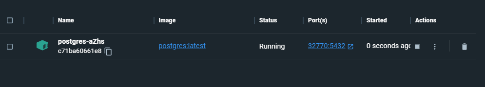
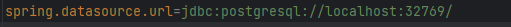
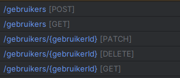

## Workshop 3

Doe eerst een `git add`
Doe een `git commit -m "jouw commit message"`
Als laatste een git pull

Als alternatief kun je in intellij onder git eerst een commit doen.
Vervolgens doe je een git pull

Api Testen met postman <br>
Clone dit project: `https://github.com/feddevanderlist/TestContainersDemoApplication.git`

Voer dan een `mvn clean verify` uit op de commandline. Of in intellij zelf aan de rechterkant met het M teken.
(Zorg dat je docker op de achtergrond draait)

Controleer of er een postgres container aan je docker is toegevoegd.
Start deze op. In het git project staat ook een readme. Lees deze door.

Installeer een postgressql container en zet in de `application.properties` zoals getoont na opstarten.<br>
 in het geval van mijn foto 32770 <br>
En plaats deze in plaats van de 32769 op dit regeltje

Start de `TestContainersDemoApplication` class op met de groene start knop.
Daarna kun je in postman met `localhost:10603/` gevolgd door de verschillende naamgeving beginnen met informatie
ophalen.

De url van de api is `localhost:10603/gebruiker` <br>
Hierop kun je en GET, POST, PATCH en DELETE doen

- Begin met gebruiker probeer er eens eentje aan te maken
- Vraag hem dan terug
- Update een van de onderdelen. Bijvoorbeeld de naam of de leeftijd
- Probeer dit ook met de andere klassen en als laatste
  <br> Alvast een voorbeeld body:

```json
  {
  "id": 1,
  "voornaam": "Homer",
  "achternaam": "Simpson",
  "leeftijd": 45,
  "titel": "Animated Character",
  "admin": false
}
```

Probeer uit te zoeken of het aanmaken, updaten, opvragen en verwijderen werkt
Denk ook na over uitzonderingen. Bijvoorbeeld verwijder een niet bestaande entry of andere dingen.
Volgende week gaan wij deze werkzaamheden automatiseren.

Mocht je een sneak peak willen kijk eens op: https://www.testcontainers.org/
https://www.javatpoint.com/feature-file-in-cucumber-testing
